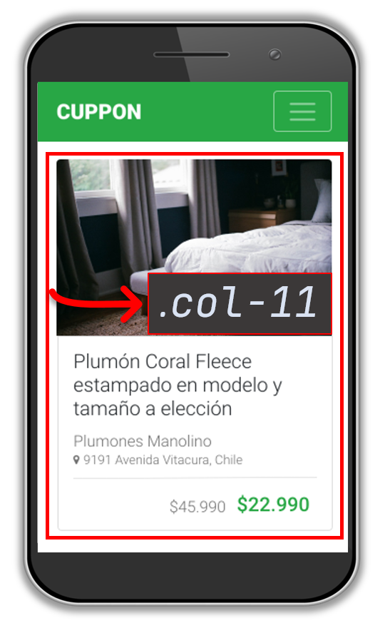
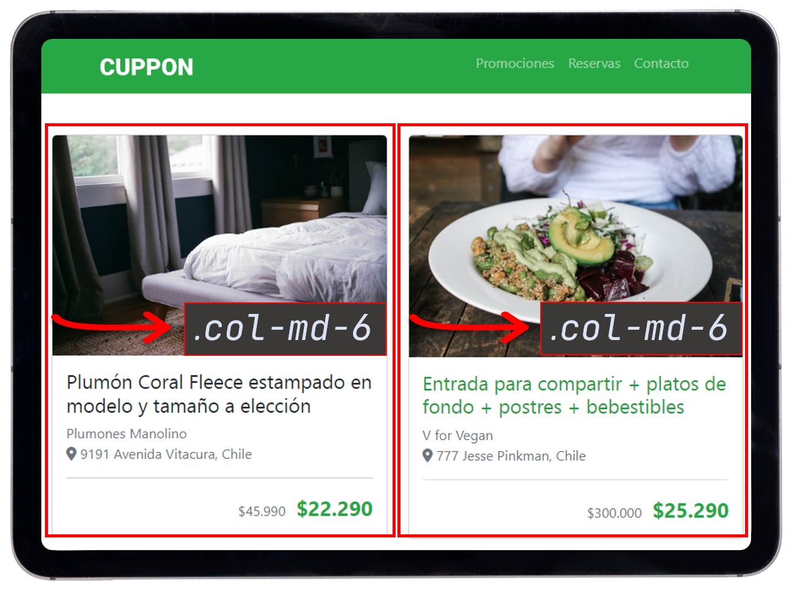
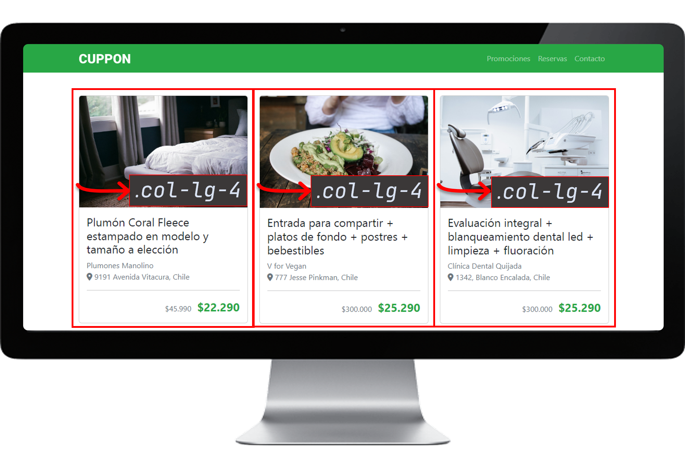

## Descripción

- **Colores**
	- {: data-color='#212529' style='--color:#212529' }
	- {: data-color='#707070' style='--color:#707070' }
	- {: data-color='#F8F9FA o var(--light)' style='--color:#F8F9FA' }
	- {: data-color='#FFF o var(--white)' style='--color:#FFF' }
	- {: data-color='#28A745 o var(--success)' style='--color:#28A745' }

---

## Creando el layout responsivo

Como sabemos **bootstrap** ofrece una grilla compuesta por 12 columnas, en ella se puede especificar cuántas columnas ocupará un solo elemento.

<div class="container mb-4">
  <div class="row g-2">
    <div class="col-12 border border-light py-2">
    	.col-12
    </div>
    <div class="col-6 border border-light py-2">
    	.col-6
    </div>
    <div class="col-6 border border-light py-2">
    	.col-6
    </div>
    <div class="col-3 border border-light py-2">
    	.col-3
    </div>
    <div class="col-3 border border-light py-2">
    	.col-3
    </div>
    <div class="col-3 border border-light py-2">
    	.col-3
    </div>
    <div class="col-3 border border-light py-2">
    	.col-3
    </div>
    <div class="col-12 border border-light py-2">
    	.col-12
    </div>
  </div>
</div>

### Punto de interrupción (*breakpoint*)

Los puntos de interrupción son claves para un **diseño responsive** son anchos personalizables que determinan como se deben comportar los elementos afectados. Boostrap incluye 6 puntos de interrupción:

<div class="table-responsive" markdown="1">

{: .table }
|Breakpoint|Dispositivo|Tamaño|
|:---------|:----------|:-----|
|`x-small`|**None**|< 576px|
|`small`|**sm**|≥ 576px|
|`medium`|**md**|≥ 768px|
|`large`|**lg**|≥ 992px|
|`extra-large`|**xl**|≥ 1200px|
|`extra-extra-large`|**xxl**|≥ 1400px|

</div>

### Agregar el componente navbar


Sabiendo lo anterior podemos partir agregando el componentes de navegación:


```html
<nav class="navbar navbar-dark navbar-expand-md">
	<div class="container">
	  <!-- LOGO MARCA -->
	  <a href="#" class="navbar-brand">
	    
	  </a>
	  <!-- BUTTON HAMBURGUESA -->
	  <button class="navbar-toggler" type="button" data-bs-toggle="collapse" data-bs-target="#my-nav"
	    aria-controls="main-nav" aria-label="Toggle navigation" aria-expanded="false">
	    <span class="navbar-toggler-icon"></span>
	  </button>
	  <!-- MENU -->
	  <div class="collapse navbar-collapse" id="my-nav">
	    <ul class="navbar-nav ms-auto mb-2 mb-lg-0">
	      <a href="#promociones" class="nav-link">Promociones</a>
	      <a href="#reservas" class="nav-link">Reservas</a>
	      <a href="#contacto" class="nav-link">Contacto</a>
	    </ul>
	  </div>
	</div>
</nav>
```
{: .nolineno }

Como vemos el componentes [navbar](https://getbootstrap.com/docs/5.3/components/navbar/){:target='_blank'} ya es responsivo, y sólo nos basta con indicar con la clase `navbar-expand-md` que su comportamiento cambie cuando el dispositivo tenga un ancho **≥ 768px**.

### Configurar grilla

Para crear una card responsive, aquí si tenemos usar en esta la grilla de bootstrap.

{2}
```html
<!-- PROMOS SECTION -->
<section class="container-lg my-5">
  <!-- fila -->
</section>
```

Como podemos observar, tenemos un `section class='container my-5'`{: .tag } como sabemos el sistema de grilla debe tener un contenedor que lo estamos proporcionando con la clase `container` y para que el contenido no esté apegado a la navegación y pie de página añadimos la clase `my-5` para agregar margenes arriba y abajo (*en el eje y*).


### Configurar la fila

Luego de especificar un contenedor para colocar los elementos dentro de él. Ahí se especificará una fila:

{2}
```html
<section class="container-lg my-5">
  <div class="row">
    <!-- columnas -->
  </div>
</section>
```

Ahora para continuar con las columnas, ya vimos que lo que son los (*breakpoints*) asi que esto es importante para que cada columna pueda ocupar el ancho que corresponda según el disposiivo.

Veamos rápidamente el uso de (*breakpoints*) en columnas:

<div class="table-responsive">
<table class="table" border="1">
  <thead class="text-center">
    <th class="h1">📺</th>
    <th>Muy pequeño<br><span class="font-weight-normal">&lt;576 px</span></th>
    <th>Pequeño<br><span class="font-weight-normal">&ge;576 px</span></th>
    <th>Medio<br><span class="font-weight-normal">&ge;768 px</span></th>
    <th>Grande<br><span class="font-weight-normal">&ge;992 px</span></th>
    <th>Extra grande<br><span class="font-weight-normal">&ge;1200 px</span></th>
  </thead>
  <tbody>
    <tr>
      <th>Prefijo clase</th>
      <td><code>.col-</code></td>
      <td><code>.col-sm-</code></td>
      <td><code>.col-md-</code></td>
      <td><code>.col-lg-</code></td>
      <td><code>.col-xl-</code></td>
    </tr>
  </tbody>
</table>
</div>

### Configurar columna

Como vemos tenemos una columna que está configurada de la siguiente manera:

<div class="row align-items-center text-center" markdown="1">
<div class="col-11 col-md-4" markdown="1">
{:height='380'}
</div>
<div class="col-11 col-md-8" markdown="1">
{:height='350'}
</div>
<div class="col-11" markdown="1">
{:height='450'}
</div>
</div>

{3}
```html
<section class="container-lg my-5">
  <div class="row">
    <div class="mx-auto col-11 col-md-6 col-lg-4">
      <!-- card -->
    </div>
  </div>
</section>
```

## Resultado




```html
{{ site.data.m2.cuppon.html }}
```



```css
{{ site.data.m2.cuppon.css }}
```




