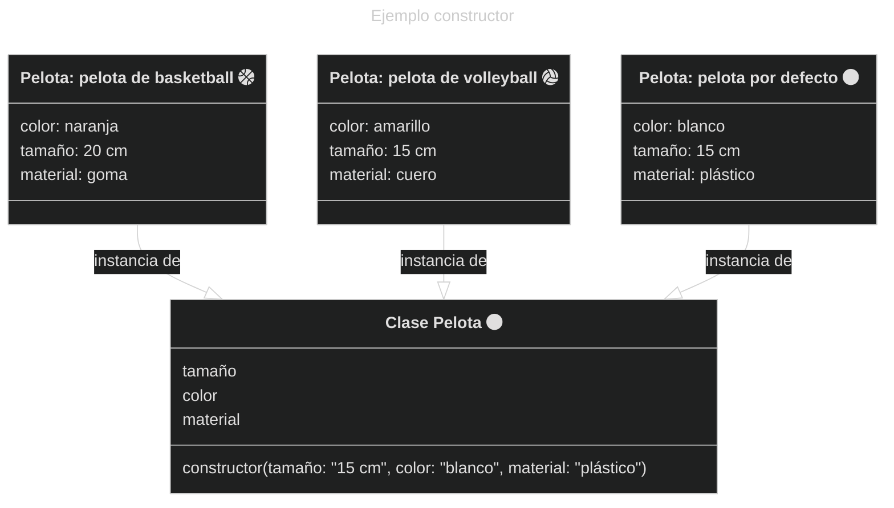

### Método constructor

Es un método que se **ejecuta automáticamente** al momento de crear una instancia de la clase, sin necesidad de ser llamado explícitamente.

- Su función es dar valores a los atributos de la instancia recién creada. Los valores que se dan a los atributos pueden ser simplemente un valor por defecto (definido en el constructor) o valores que se deben especificar explícitamente al momento de crear la instancia.
- Dependiendo del problema a resolver, existen dos opciones a utilizar:
	- valores por defecto
	- valores entregados explícitamente
	- además, se puede utilizar una combinación de ambas, es decir, valores por defecto que pueden ser sobreescrito por valores entregados.


{: align="center" }


### ¿Cómo se define un método constructor en Python?

- Se define exclusivamente con el nombre `__init__`.
- Debe tener como primer parámetro la instancia de la clase, usando `self`.
- No puede tener retorno (a menos que sea `None`).
- Por lo general, es el primer método definido dentro de la clase.


```py
class Pelota():
	def __init__(self):
		print("¡Se ha creado una pelota!")

p = Pelota()  # Salida: ¡Se ha creado una pelota!
```
{: .nolineno }

### Atributos de la clase

- En el constructor normalmente se asigna valores a los atributos de la clase:


```py
class Pelota():
	def __init__(self):
		self.color = "blanco"
		self.tamanio = 20
		self.material = "plástico"

p = Pelota()
print(p.color, p.tamanio, p.material) # Salida: blanco 20 plástico
```
{: .nolineno }

- Asignar valores desde parámetros del método:


```py
class Pelota():
	def __init__(self, color: str, tamanio: int, material: str):
		self.color = color
		self.tamanio = tamanio
		self.material = material

p = Pelota("Amarillo", 16, "plástico")
print(p.color, p.tamanio, p.material) # Salida: Amarillo 16 plástico
```
{: .nolineno }

- Asignar valores desde parámetros del método, con valores por defecto:


```py
class Pelota():
	def __init__(self, color: str, tamanio = 20, material = "plástico"):
		self.color = color
		self.tamanio = tamanio
		self.material = material

p = Pelota("Amarillo", 16)
print(p.color, p.tamanio, p.material) # Salida: Amarillo 16 plástico
```
{: .nolineno }
