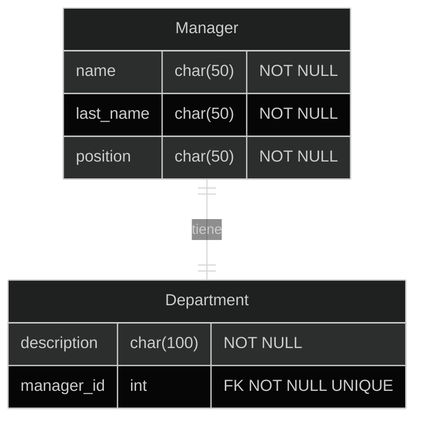
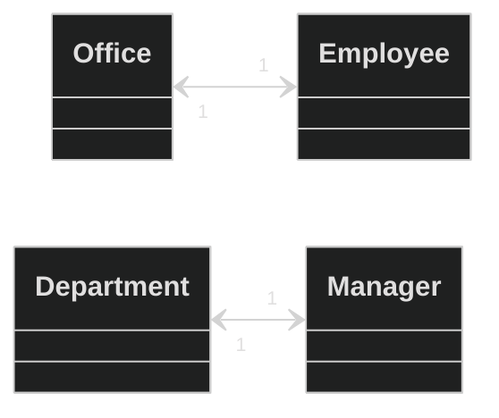

### Parámetros transversales

También existen una serie de parámetros transversales a los campos, los cuales definiremos a continuación:

{: .table .table-dark }
|parámetro|descripcipción|Por defecto|
|:--------|:-------------|:----------|
|`null`|Si `null=True`, django permitirá valores nulos|`False`|
|`blank`|Si `blank=True`, django permite grabar valores en blanco (a nivel de django)|`False`|
|`choices`|Realiza una validación en el modelo sobre los valores posibles en un campo dado.|Opcional|
|`db_column`|Este parámetro nos permite setear un nombre para la columna en la base de datos.|Opcional|

---

### Relaciones One to One

Mirando las relaciones desde el punto de vista de la bases de datos relacionales, podemos decir que una relación **One to One** existe cuando cada fila (registro) en una tabla, tiene solo una fila relacionada en una segunda tabla.

Por ejemplo, una empresa podría decidir asignar una oficina a solamente un empleado. Entonces, un empleado puede tener solo una oficina. La misma empresa podría también decidir que un departamento puede tener solo un gerente, entonces un gerente puede dirigir solamente un departamento.

{: align="center" }

Ahora, si llevamos esto al ORM, podemos decir que las filas son objetos, por lo tanto, el objeto tiene un campo de un tipo especial que lo relaciona con otro objeto.

El tipo especial de campo del que hablamos se llama `OneToOneField`. Este campo nos permite relacionar dos objetos entre sí (uno a uno), por ejemplo un empleado con su oficina, o un autor con un perfil:

{: align="center" }

Se diferencia del campo `ForeignKey` en que `OneToOne` nos permite realizar solamente una relación uno a uno y en la query se devolverá solamente un objeto relacionado.