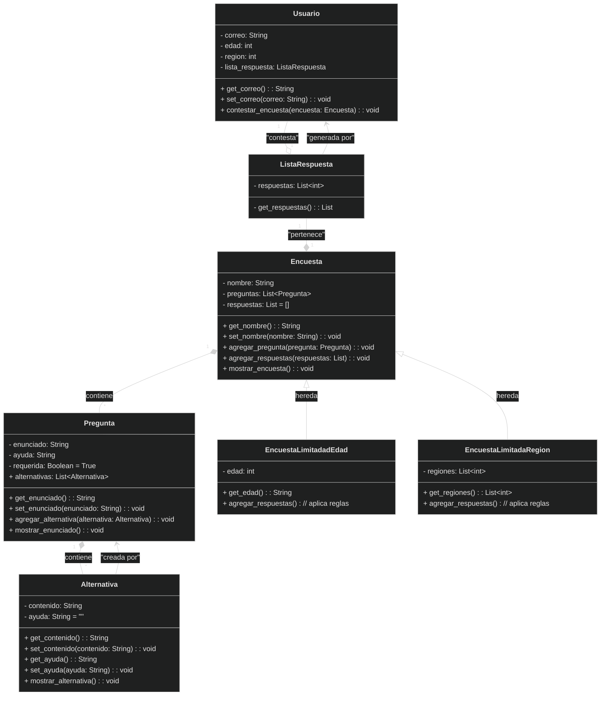

## Descripción

Te encuentras trabajando en una consultora, a la cual se le ha encargado desarrollar un software que permita crear y contestar encuestas. A ti te han solicitado diagramar, y programar en base a ello, las relaciones existentes entre usuarios, encuestas, preguntas, alternativas y respuestas. Para ello, debes considerar lo siguiente.

### Sobre las alternativas

- Una alternativa tiene:
	- Un contenido (texto)
	- Una ayuda (texto, opcional)<br>Ambos se pueden consultar y modificar libremente.
- Una alternativa solo puede existir como parte de una pregunta.
- Debe haber un mecanismo para **mostrar una alternativa**, donde se muestra su contenido y ayuda, si es que la posee.

### Sobre las preguntas

- Una pregunta tiene:
	- Un **enunciado** (texto)
	- Una **ayuda** (texto, opcional)
	- Una **indicación de si es requerida** (puede ser requerida o no serlo)
	- Y una **lista de alternativas**

- Todas estas características se pueden consultar y modificar libremente, excepto las alternativas (aún no se establecen las reglas para modificar las alternativas, pero por el momento considera que solo se pueden consultar).
- Una pregunta solo puede existir como parte de una encuesta.
- Debe haber un mecanismo para mostrar una pregunta donde se muestra su enunciado, ayuda (si es que la posee), y sus alternativas (cada una con su ayudan si la posee).

### Sobre las encuestas

- Una encuesta tiene un:
	- **Nombre** (texto)
	- Un **listado de preguntas**
	- Y un **listado de listados de respuestas** (inicialmente vacío, al crease la encuesta).
- Solo el nombre puede consultarse y modificarse libremente.
- Debe contar con un mecanismo que permita mostrar la encuesta, donde se muestra tanto el nombre de la encuesta como sus preguntas (por cada pregunta, se muestra además su posible ayuda, y sus alternativas con su posible ayuda).
- Debe contar con un mecanismo para agregar un listado de respuestas a su lista de listados de respuestas (aún no se establecen las reglas específicas).
- Existen además dos tipos específicos de encuestas:
	- **Encuestas limitadas por edad**: Además de la información contenida en cualquier encuesta, contienen una **edad mínima** (número entero).<br>Considera que estas edades requieren de reglas para modificar sus valores. En estas encuestas, el mecanismo para agregar un listado de respuestas a la lista de respuestas debe considerar que el usuario asociado al listado de respuestas tenga una edad entre la edad mínima y la edad máxima de la encuesta.
	- **Encuestas limitadas por región**: Además de la información contenida en cualquier encuesta, contienen una **lista de regiones** (lista de números enteros).<br>Considera que el listado de regiones requiere de reglas para modificar sus valores. En estas encuestas, el mecanismo para agregar un listado de respuestas a la lista de respuestas debe considerar que el usuario asociado al listado de respuestas tenga una región que se encuentre dentro del listado de regiones de la encuesta.

### Sobre el listado de respuestas

- Un listado de respuestas está asociado a un **usuario** que lo generó.
- Un listado de respuestas tiene **una lista de respuestas** (lista con números enteros).
- Tanto el usuario como las respuestas no se pueden modificar libremente, pero aún no se han establecido las reglas para ello. Por ahora considere solamente se puede leer esta información.
- Un listado de respuestas sólo puede existir como parte de una encuesta.

### Sobre los usuarios

- Un usuario tiene un correo (texto), edad (número entero) y región (número entero).<br>Todos estos datos requieren de reglas para ser modificados, pero aún no se han establecido. Por ahora considera que se pueden leer y modificar, sin agregar condiciones especiales, pero mediante mecanismos específicos.
- Debes contar con un mecanismo para contestar una encuesta, para lo cual hace uso de una encuesta y de su mecanismo para agregar un listado de respuestas a su lista de listados de respuestas.

---

## Requerimiento 1

Entregar un archivo `.png` o `.pdf` con el diagrama de clases que permita representar lo descrito en el contexto del problema.

Considerar incluir:

- Clases involucradas
- Atributos (especificando toda la información pertinente)
- Operaciones
- Relaciones entre clases

### Diagrama desarrollado



## Requerimiento 2

A partir del diagrama de clases del requerimiento 1, en un archivo `alternativa.py`, crear la clase que permita crear objetos de tipo **Alternativas**.

- Dentro de la clase, incluir todo  lo especificado en el diagrama de clase.
- **Opcional**: implementar la lógica de las operaciones.

### Solución a la clase Alternativa


```py
class Alternativa():

    def __init__(self, contenido, ayuda = '') -> None:
        self.__contenido = contenido
        self.__ayuda = ayuda

    @property
    def contenido(self) -> str:
        return self.__contenido

    @contenido.setter
    def contenido(self, new_contenido) -> None:
        self.__contenido = new_contenido
    
    @property
    def ayuda(self) -> str:
        if self.__ayuda:
            return self.__ayuda

    @ayuda.setter
    def ayuda(self, new_ayuda) -> None:
        self.__ayuda = new_ayuda
    
    def mostrar_alternativa(self) -> None:
        print(self.contenido, '[{}]'.format(self.ayuda) if self.ayuda else '')

if __name__ == "__main__":
    a1 = Alternativa('Alternativa n° 1', 'ayuda de alternativa 1')
    a2 = Alternativa('Alternativa n° 2')
    a1.mostrar_alternativa()
    a2.mostrar_alternativa()
```
{: .nolineno }

## Requerimiento 3

A partir del diagrama de clases del requerimiento 1, en un archivo `pregunta.py`, crear la clase que permita crear objetos de tipo **Pregunta**.

- Dentro de la clase, incluir todo lo especificado en el diagrama de clases.
- **Opcional**: implementar lógica de las operaciones.

> **Tip**: Considera que las alternativas son entregadas como una lista de diccionarios.

### Solución a la clase Pregunta


```py
from alternativa import Alternativa

class Pregunta():
    def __init__(self, enunciado, ayuda=None, requerida=True):
        self.__enunciado = enunciado
        self.__ayuda = ayuda
        self.__requerida = requerida
        self.__alternativas = []

    def agregar_alternativa(self, contenido, ayuda=None):
        nueva_alternativa = Alternativa(contenido, ayuda)
        self.__alternativas.append(nueva_alternativa)

    @property
    def enunciado(self):
        return self.__enunciado

    @enunciado.setter
    def enunciado(self, new_enunciado):
        self.__enunciado = new_enunciado

    @property
    def ayuda(self):
        return self.__ayuda

    @ayuda.setter
    def ayuda(self, new_ayuda):
        self.__ayuda = new_ayuda

    @property
    def requerida(self):
        return self.__requerida
    
    @requerida.setter
    def requerida(self, new_requerida):
        if new_requerida not in (True, False):
            raise ValueError("El valor debe ser True o False")
        else:    
            self.__requerida = new_requerida

    def mostrar_enunciado(self) -> None:
        print(self.enunciado, '[{}]'.format(self.ayuda) if self.ayuda else '')
        print('(pregunta requerida)' if self.requerida else '(pregunta opcional)')
        for num, alternativa in enumerate(self.__alternativas, 1):
            print(f"{num})", end=" ")
            alternativa.mostrar_alternativa()

if __name__ == "__main__":
    p1 = Pregunta('¿Cómo se dice hola en inglés?', requerida=False)
    p1.agregar_alternativa("Hi")
    p1.agregar_alternativa("Yes")
    p1.agregar_alternativa("Thanks")
    p1.mostrar_enunciado()
```
{: .nolineno }

## Requerimiento 4

A partir del diagrama de clases del requerimiento 1, en un archivo `encuesta.py`, crear las clases que permitan crear objetos de tipo **Encuesta**, **EncuestaLimitadaEdad** y **EncuestaLimitadaRegion**.

- Dentro de la clase, incluir todo lo especificado en el diagrama de clases.
- **Opcional**: implementar la lógica de las operaciones.

> **Tip**: Considera que las preguntas son entregadas como una lista de diccionarios.

## Requerimiento 5

A partir del diagrama de clases del requerimiento 1, en un archivo `usuario.py`, crear la clase que permita crear objetos de tipo **Usuarios**.

- Dentro de la clase, incluir todo lo especificado en el diagrama de clases.
- **Opcional**: implementar la lógica de las operaciones. En caso de hacerlo, debe primero crear la clase **ListadoRespuestas**, y luego implementar el comportamiento de esta clase.

## Requerimiento 6

A partir del diagrama de clases del requerimiento 1, en un archivo `listado_respuestas.py`, crear la clase que permita crear objetos de tipo **ListadoRespuestas**.

- Dentro de la clase, incluir todo lo especificado en el diagrama de clases.

### Solución


```py
class ListaRespuesta():
	pass
```
{: .nolineno }

