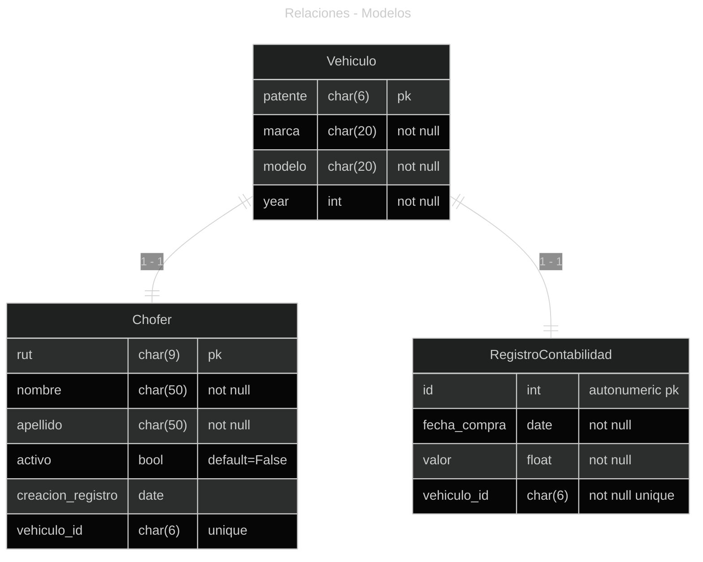

## Descripción

En el presente desafío, se realizará el modelamiento de un pequeño sistema, básico en cuanto a funcionalidades, pero que nos permitirá realizar un análisis similar a lo que se necesitaría en un sistema comercial, donde debemos relacionar modelos y crear operaciones que nos permitan la operación con los datos que guardaremos en la base de datos.

En este desafío construiremos el modelo de datos para una empresa que maneja vehículos utilitarios de reparto. Estos vehículos son asignados a un chofer y también tienen su registro único en contabilidad como muestra el diagrama:

{: align="center" }


Para este proyecto se debe desarrollar los modelos de acuerdo al diagrama. Los servicios que nos darán la interfaz para trabajar con el modelo. Estos son:

**crear_vehiculo**
: función que se encargará de crear un nuevo vehículo.

**crear_chofer**
: función que se encargará de crear un chofer.

**crear_registro_contable**
: función que se encargará de crear un registro contable (es necesario que exista un vehículos antes de invocar la función).

**deshabilitar_chofer**
: función que se encargará de deshabilitar a un chofer (cambiar el atributo activo al objeto).

**deshabilitar_vehiculo**
: función que se encargará de deshabilitar a un chofer (por medio del modelo relacionado `Vehiculo`).

**habilitar_chofer**
: función que se encargará de habilitar a un chofer (cambiando nuevamente su atributo activo al objeto).

**habilitar_vehiculo**
: función que se encargará de habilitar al chofer (por medio del modelo relacionado `Vehiculo`).

**obtener_vehiculo**
: función que se encargará de retornar un objeto utilizando un identificador.

**obtener_chofer**
: función que se encargará de retornar un chofer utilizando un identificador.

**asignar_chofer_a_vehiculo**
: función que se encargará de asociar un chofer a un vehículo, para ello debemos recibir un vehículo y un chofer como parámetros.

**imprimir_datos_vehiculos**
: función que va a mostrar toda la información de los vehículos.

---

## Desarrollo

- Creación de los modelos y sus relaciones 
- Creación de los servicios solicitados.
- Capturas de pantallas mostrando la ejecución y salidas de los servicios.





```python
from django.db import models
from django.core.exceptions import ValidationError

class Vehiculo(models.Model):
    patente = models.CharField(max_length=6, primary_key=True)
    marca = models.CharField(max_length=20, null=False)
    modelo = models.CharField(max_length=20, null=False)
    activo = models.BooleanField(default=False)
    year = models.IntegerField()

    def clean(self):
        if len(self.patente) > 6 or len(self.patente) < 6:
            raise ValidationError(
                "patente no válida, la patente debe tener una longitud exacta de 6 caracteres"
            )

    def save(self, *args, **kwargs):
        self.clean()
        super().save(*args, **kwargs)

    def __str__(self):
        return f"[{self.patente}] {self.marca} {self.modelo}"


class Chofer(models.Model):
    rut = models.CharField(max_length=9, primary_key=True)
    nombre = models.CharField(max_length=50, null=False)
    apellido = models.CharField(max_length=50, null=False)
    activo = models.BooleanField(default=False)
    creacion_registro = models.DateField(auto_now=True)
    vehiculo = models.OneToOneField(Vehiculo, on_delete=models.CASCADE)


class RegistroContabilidad(models.Model):
    fecha_compra = models.DateField(null=False)
    valor = models.FloatField(null=False)
    vehiculo = models.OneToOneField(Vehiculo, on_delete=models.CASCADE)
```
{: .nolineno }



```py
from .models import Vehiculo, Chofer, RegistroContabilidad

def crear_vehiculo(patente, marca, modelo, year):
    return Vehiculo.objects.create(
        patente=patente, marca=marca, modelo=modelo, year=year
    )

def crear_chofer(rut, nombre, apellido, creacion, vehiculo):
    chofer = Chofer(
        rut=rut,
        nombre=nombre,
        apellido=apellido,
        creacion_registro=creacion,
        vehiculo=vehiculo,
    )
    chofer.save()

def crear_registro_contable(fecha_compra, valor, vehiculo):
    RegistroContabilidad(
        fecha_compra=fecha_compra, valor=valor, vehiculo=vehiculo
    ).save()

def deshabilitar_chofer(chofer):
    chofer = Chofer.objects.get(pk=chofer.rut)
    chofer.activo = False
    chofer.save()

def deshabilitar_vehiculo(vehiculo):
    vehiculo = Vehiculo.objects.get(pk=vehiculo.patente)
    vehiculo.activo = False
    vehiculo.save()

def habilitar_chofer(chofer):
    chofer = Chofer.objects.get(pk=chofer.rut)
    chofer.activo = True
    chofer.save()

def habilitar_vehiculo(vehiculo):
    vehiculo = Vehiculo.objects.get(pk=vehiculo.patente)
    vehiculo.activo = True
    vehiculo.save()

def obtener_vehiculo(vehiculo):
    return Vehiculo.objects.get(pk=vehiculo.patente)

def obtener_chofer(chofer):
    return Chofer.objects.get(pk=chofer.rut)

def asignar_chofer_a_vehiculo(chofer, vehiculo):
    try:
        actualizado = Chofer.objects.filter(rut=chofer.rut).update(vehiculo=vehiculo)
        if actualizado == 1:
            print("Se actualizo correctamente")
    except Exception as e:
        print(e)

def imprimir_datos_vehiculos():
    print("== Vehículos actuales ==")
    for vehiculo in Vehiculo.objects.all():
        print(vehiculo)
```
{: .nolineno }



---

## Repositorio


