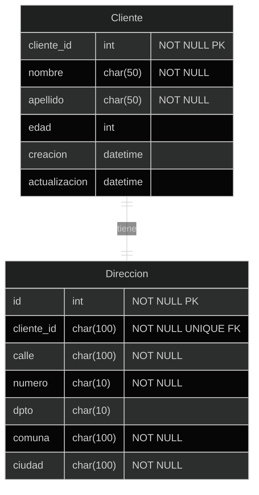

## Ejercicio OneToOneField

Crearemos dos modelos, uno `Cliente` y otro `Direccion`. Entre estos habrá una relación One to One, ya que una dirección pertenece a un cliente y un cliente tiene asociada solo una dirección. (Para efectos prácticos del ejercicio, excluimos la posibilidad que dos o más clientes vivan en la misma dirección).

{: align="center"}


Primero que todo, debemos crear un entorno virtual, un proyecto y una app (que debe ser registrada en settings.py).

En este ejercicio utilizaremos SQLite3, por lo que no debemos realizar configuraciones adicionales en la base de datos.

Para generar un modelo propuesto escribiremos los siguientes modelos:


```py
class Cliente(models.Model):
	cliente_id = models.AutoField(primary_key=True)
	nombre = models.CharField(max_length=50, blank=False, null=False)
	apellido = models.CharField(max_length=50, blank=False, null=False)
	edad = models.IntegerField(null=True, blank=True)
	creacion = models.DateTimeField(auto_now_add=True)
	actualización = models.DateTimeField(auto_now=True)

class Direccion(models.Model):
	cliente = models.OneToOneField(Cliente, blank=False, null=False, on_delete=models.CASCADE)
	calle = models.CharField(max_length=100, blank=False, null=False)
	numero = models.CharField(max_length=10, blank=False, null=False)
	dpto = models.CharField(max_length=10, blank=True, null=True)
	comuna = models.CharField(max_length=100, blank=False, null=False)
	ciudad = models.CharField(max_length=100, blank=False, null=False)
```
{: .nolineno }

Podemos ver una relación One to One, la cual está definida en el modelo `Dirección`, por pertenencia de `Cliente`.

Ahora entramos al shell de django. Importamos los objetos como se muestra a continuación y crearemos dos objetos "**cliente**" y "**direccion**":


```python
from appname.models import Cliente, Direccion

cliente = Cliente(nombre="Juan", apellido="Perez", edad=30)
cliente.save()
direccion = Direccion(cliente=cliente, calle="alguna calle", numero="1234", dpto="1234", comuna="Santiago", ciudad="Santiago")
direccion.save()
```
{: .nolineno }

Ahora, sobre los ejemplos existentes, revisaremos la bidireccionalidad de este campo, para esto utilizaremos la propiedad `__dict__`, que nos permite obtener la representación de las propiedades o campos del objeto como un dato del tipo `dict`:

{1}
```py
>>> cliente.direccion.__dict__
{'_state': <django.db.models.base.ModelState at 0x5eda648>,
 'id': 1,
 'cliente_id': 1,
 'calle': 'alguna calle',
 'numero': '1234',
 'dpto': '1234',
 'comuna': 'Santiago',
 'ciudad': 'Santiago'}
```

{1}
```py
>>> direccion.cliente.__dict__
{'_state': <django.db.models.base.ModelState at 0x82133c8>,
 'cliente_id': 1,
 'nombre': 'john',
 'apellido': 'doe',
 'edad': 33,
 'creacion': datetime.datetime(2024, 8, 4, 0, 5, 33, 530637, tzinfo=<UTC>),
 'actualización': datetime.datetime(2024, 8, 4, 0, 5, 33, 530637, tzinfo=<UTC>)}
```

Ahora, realizaremos el ejercicio de eliminar un objeto, y así podemos obtener el comportamiento obtenido por el parámetro `on_delete=models.CASCADE`:

{1}
```py
>>> cliente.delete()
 (2, {'appname.Direccion': 1, 'appname.Cliente': 1})
```

## Ejercicio ManyToManyField

Para el desarrollo de este nuevo ejercicio crearemos un nuevo proyecto Django o usar el mismo anterior y hacer una aplicación que luego registramos en `settings.py`.

Crearemos los modelos necesarios para realizar la estructura que tenemos en el diagrama:


```python
from django.db import models

class Libro(models.Model):
	titulo = models.CharField(max_length=100, null=False, blank=False)
	year = models.IntegerField(null=False, blank=False)

class Autor(models.Model):
	nombre = models.CharField(max_length=50, null=False, blank=False)
	apellido = models.CharField(max_length=50, null=False, blank=False)
	libros = models.ManyToManyField(Libro, related_name="autores")

class AutorLibro(models.Model):
	autor = models.ForeignKey(Autor, on_delete=models.CASCADE)
	libro = models.ForeignKey(Libro, on_delete=models.CASCADE)
	creado_por = models.CharField(max_length=50, null=False, blank=False)
	creacion = models.DateTimeField(auto_now_add=True)
```
{: .nolineno }

Realizamos las siguientes operaciones:

- Crear dos libros
- Crear 4 autores
- Asociar
- autor1 y autor3 al libro1, agregando la relación con el autor desde el modelo libro y luego completarla
- autor2 y autor4 al libro2 creando las relaciones como un objeto
- Eliminar autor1 del libro1, revisar cómo quedó la tabla de relaciones
- Eliminar libro2 y revisar qué pasa con las relaciones existentes

Una vez aplicadas las migraciones necesarias. Ingresamos al shell de django y crearemos objetos para nuestros autores.


