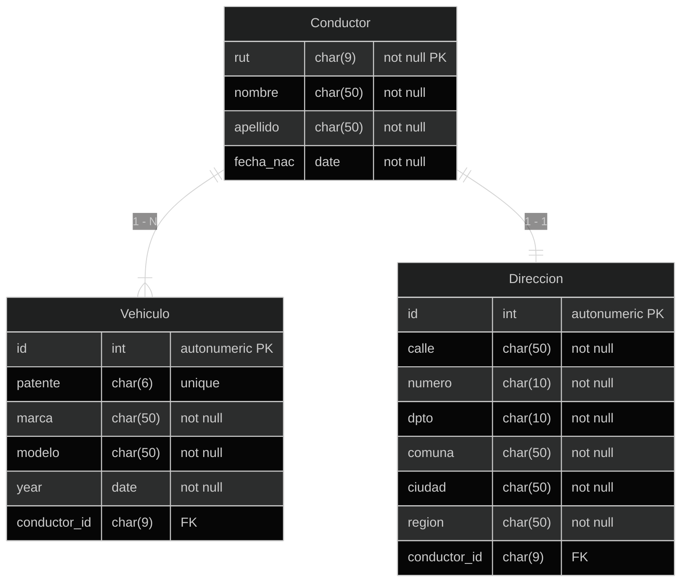

### Ejercicio Propuesto 1

Se solicita la creación de un proyecto de Django, con una aplicación llamada **registro_conductores**, el cual nos permitirá registrar el conductor de un vehículo, con su dirección y los vehículos que posee.

En el `models.py` tendremos 3 modelos: `Conductor`, `Vehiculo`, `Direccion`.

Los cuales deben basarse en lo expuesto en la siguiente imagen. (Para efectos prácticos, se considerará que solo existe un conductor por dirección).

{: align="center" }


- El rut del cliente debe permitir 9 caracteres numéricos (con dígito verificador, sin guión ni puntos).
- La relación entre el cliente y la dirección y el cliente y el vehículo se debe eliminar en cascada.
- Se deben utilizar los siguientes elementos:
	- `ForeignKey`
	- `OneToOneField`
- Se debe crear un archivo `services.py` en la aplicación que debe contener las siguientes acciones:
	- `crear_conductor`
	- `agregar_direccion_a_conductor`
	- `agregar_un_vehiculo`
	- `eliminar_vehiculo`
	- `eliminar_conductor`
- Luego de ejecutar cada acción, se debe imprimir por pantalla el contenido de los modelos.

#### Solución

Registramos la aplicación en `settings.py` y generamos los modelos correspondientes en `registro_conductor/models.py`:


```py
from django.db import models

class Conductor(models.Model):
	rut = models.CharField(max_length=9, primary_key=True), 
	nombre = models.CharField(max_length=50, null=False, blank=False)
	apellido = models.CharField(max_length=50, null=False, blank=False)
	fecha_nac = models.DateField(null=False, blank=false)

class Direccion(models.Model):
	calle = models.CharField(max_length=50, null=False, blank=False)
	numero = models.CharField(max_length=10, null=False, blank=False)
	dpto = models.CharField(max_length=50, null=True, blank=True)
	comuna = models.CharField(max_length=50, null=False, blank=False)
	ciudad = models.CharField(max_length=50, null=False, blank=False)
	region = models.CharField(max_length=50, null=False, blank=False)
	conductor = models.OneToOneField("Conductor", null=False, blank=false, on_delete=models.CASCADE)

class Vehiculo(models.Model):
	patente = models.CharField(max_length=6, null=False, blank=False)
	marca = models.CharField(max_length=50, null=False, blank=False)
	modelo = models.CharField(max_length=50, null=False, blank=False)
	year = models.DateField(null=False, blank=False)
	conductor = models.ForeignKey("Conductor", null=False, blank=False, on_delete=models.CASCADE)
```
{: .nolineno }